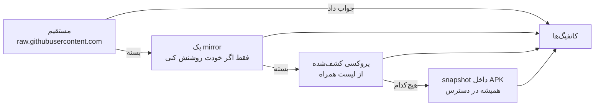

# v2rayV — کلاینت اندرویدی V2Ray که خودش وصل می‌شود

v2rayV یک کلاینت رایگان و متن‌باز V2Ray / Xray برای اندروید است، برای کسانی که از ساب‌های
عمومی استفاده می‌کنند و ترجیح می‌دهند خودِ برنامه سرور سالم را پیدا کند تا اینکه یکی‌یکی روی
سرورهای مرده بزنند. از VLESS، Reality، VMess، Trojan، Shadowsocks، Hysteria2 و TUIC
پشتیبانی می‌کند.

<div align="center">


<p><b>بقیهٔ کلاینت‌ها سیصد سرور جلویت می‌گذارند و برایت آرزوی موفقیت می‌کنند.<br>
این یکی سرعت خط خودت را می‌سنجد، سرورها را در برابر همان می‌آزماید، و روی اولین سروری که
واقعاً برای تو به‌اندازهٔ کافی سریع است وصل می‌شود.</b></p>

<p>


</p>


&nbsp;&nbsp;

&nbsp;&nbsp;


<sub>وصل‌شده روی سروری که خودش پیدا کرده · منوی کناری · تنظیمات Auto Mode</sub>

<br><br>

<sub><a href="README.md">English</a> · <b>فارسی</b> · <a href="README.ru.md">Русский</a> · <a href="README.zh.md">中文</a></sub>

</div>

---

<div dir="rtl">

> [!NOTE]
> **روزهای اول.** Auto Mode روی دستگاه واقعی سرتاسر تست شده — از فشار دکمهٔ پاور تا وصل‌شدن
> APK های امضاشده در صفحهٔ [Releases](../../releases) هستند.
> مسیر جایگزین برای شبکهٔ فیلترشده (میرور اختیاری ← پروکسی‌های کشف‌شده) کامپایل و unit-test
> شده، ولی هنوز روی شبکه‌ای که واقعاً GitHub را بسته امتحان نشده.

## چرا وجود دارد

یک لینک ساب چند صد سرور به تو می‌دهد. بیشترشان مرده‌اند. بعضی زنده‌اند ولی از خودِ اینترنت تو
کندترند. کلاینت همه را در فهرستی نشان می‌دهد که بر اساس هیچ‌چیز مرتب نشده، و تو را رها می‌کند
تا یکی‌یکی امتحان کنی و شکست‌خوردنشان را تماشا کنی.

v2rayV این کار را خودش می‌کند. همهٔ منابعت را import می‌کند، هرچه ترافیک نمی‌برد را دور
می‌ریزد، بازمانده‌ها را **در برابر سرعت خط خودت** می‌سنجد، و روی اولین سروری که از خط عبور
می‌کند وصل می‌شود. بعد در پس‌زمینه ادامه می‌دهد تا فشار بعدی آنی باشد.

روی دستگاه واقعی: **۷۶ لینک ادغام ← ۶۰۹ کاندید import ← ۳۹ تونل‌شده ← ۴ نگه‌داشته**، خط
۳٫۸۹ مگابایت بر ثانیه اندازه‌گیری شد و اولین سرور پذیرفته‌شده ۳٫۰ تحویل داد.

---

## Auto Mode

یک دکمه. منابع ساب را می‌کشد، هرچه پیدا کرد import می‌کند، فیلتر و اندازه‌گیری می‌کند، و
برنده‌ها را به‌عنوان سرورهای آمادهٔ استفاده نگه می‌دارد.

سرور انتخاب نمی‌کنی. ping test نمی‌گیری و حدس نمی‌زنی عددها یعنی چه. دکمهٔ پاور را می‌زنی.

---

## حالت ایران (IR)

از مسیر **Auto Mode ← Iran (IR)**. کل ماجرا برعکس می‌شود: به‌جای بیرون‌بردنت از ایران،
تو را *به داخل* ایران وصل می‌کند. برای ایرانی‌های خارج از کشور که بانک، بیمه، سامانهٔ
مالیاتی و اپ‌های داخلی‌شان به IP نگاه می‌کنند و آدرس خارجی را قبول نمی‌کنند.

همان pipeline و همان اندازه‌گیری‌ها، با سه تفاوت عمدی:

| در حالت ایران | چرا |
|---|---|
| **فقط سرورهایی نگه داشته می‌شوند که خروجی‌شان اندازه‌گیری‌شده داخل ایران باشد.** لیست با سریع‌ترین سرور هرجای دیگر پر نمی‌شود. | این دقیقاً کاری است که فیلتر کشور می‌کند، و اینجا نتیجه‌اش اتصالی است که موفق به‌نظر می‌رسد و باز هم به بانک نمی‌رسد. اگر چیزی پیدا نشد، همان را گزارش می‌کند. |
| **کشور بالاتر از پروتکل رتبه می‌گیرد** — برعکس حالت عادی. | یک سرور REALITY در فرانکفورت با هیچ سرعتی این کار را نمی‌کند؛ یک سرور کندِ ایرانی می‌کند. |
| **کانفیگ ناامن رد می‌شود، نه اینکه رتبهٔ پایین بگیرد:** نه SOCKS و HTTP، نه چیزی که ترافیک را رمزنشده ببرد، نه چیزی که بررسی certificate را خاموش کرده باشد. | این ترافیک بانکِ یک آدم است، و دارد از روی ماشینی عبور می‌کند که داخل همان شبکه‌ای نشسته که کاربر از طریقش وصل می‌شود. |
| **سایت‌های ایرانی دیگر از تونل رد نمی‌شوند.** preset مسیریابی ایران، `geoip:ir` و `geosite:category-ir` را مستقیم از گوشی بیرون می‌فرستد؛ تا وقتی یک سرور ایرانی اتصال را حمل می‌کند این ورودی‌ها حذف می‌شوند. | بدون این، بانک باز هم آدرس خارجی را می‌دید و هیچ‌چیز خراب به‌نظر نمی‌رسید. ruleset ذخیره‌شدهٔ خودت دست نمی‌خورد — حالت را خاموش کنی، برمی‌گردد. |

انتظار داشته باش کندتر از یک اتصال عادی باشد: محدودیت، لینک ایران به بیرون است نه سرور.
حد پذیرش هم به همان نسبت پایین می‌آید — از ۷۰٪ خط خودت به ۱۰٪.

ساب‌های عمومی معمولاً سرور خروجی ایران ندارند. این حالت وقتی بهترین جواب را می‌دهد که
سرور خودت را بهش بدهی — از **Auto Mode ← ویرایش لینک‌ها**، یا به‌عنوان یک پروفایل معمولی.

---

## تصمیم‌هایی که کل ماجرا رویشان سوار است

بیشترشان از روی اندازه‌گیری به دست آمده‌اند و چندتایشان دقیقاً برعکس کاری است که بقیه می‌کنند.

</div>

| تصمیم | چرا |
|---|---|
| **پذیرش نسبی است، نه مطلق.** سرور وقتی خوب است که دست‌کم ۷۰٪ چیزی را بدهد که خط خالی‌ات می‌دهد. | هدف ثابت بر حسب مگابایت، روی خط کند همه را رد می‌کند و روی خط سریع کم‌فروشی می‌کند. |
| **خط تو و هر سرور با یک probe یکسان سنجیده می‌شوند**، عمداً تک‌جریانی. | این دو عدد بر هم تقسیم می‌شوند، پس باید یک اندازه‌گیری باشند. اگر خط را به روش کتابی با ۴ تا ۸ جریان موازی بسنجی، هیچ سروری هرگز از ۷۰٪ رد نمی‌شود. |
| **دسترس‌پذیری TCP هاست‌ها را حذف می‌کند، هرگز رتبه‌بندی‌شان نمی‌کند.** | روی یک استخر واقعی اندازه‌گیری شد: مرتب‌سازی بر اساس کمترین tcping **۲٫۱٪** قبولی داد، در برابر **۷٫۵٪** برای انتخاب تصادفی. سریع‌ترین جواب‌دهنده‌ها CDN edge هایی جلوی پروکسی‌های مرده‌اند. |
| **کاندیدها بر اساس پروتکل و کشورِ خوانده‌شده از خود کانفیگ مرتب می‌شوند، نه بر اساس اندازه‌گیری.** تصادفی‌بودن *درون* هر لایه حفظ می‌شود. | مرتب‌سازی مجانی است؛ اندازه‌گیری نه. تصادف درون لایه باعث می‌شود هر اجرا کشف کند نه اینکه دیروز را دوباره تأیید کند. |
| **ترتیب پروتکل:** VLESS+REALITY / XTLS-Vision ← Hysteria2 / TUIC ← بقیه ← WireGuard آخر. | بر اساس گزارش‌های ۲۰۲۶ دربارهٔ DPI در ایران. WireGuard به‌طور قابل‌اتکا تشخیص داده می‌شود. |
| **ترتیب کشور:** DE ← NL ← FR ← TR. | ترکیه کمترین ping را دارد و کمترین ظرفیت را، پس بعد از اروپایی‌ها می‌آید. |
| **تست سرعت اکیداً یکی‌یکی اجرا می‌شود.** | دو دانلود که روی یک رادیو مسابقه بدهند، رادیو را می‌سنجند نه سرورها را. |
| **سروری که دوباره برنده شود، رکورد موجودش را نگه می‌دارد.** | آن سروری که تو انتخابش کرده‌ای — و تونل رویش سوار است — از زیر پایت حذف نمی‌شود. |
| **لینک‌های ساب خامِ داخل بدنهٔ دانلودشده قبل از import حذف می‌شوند.** | منبعی که در واقع فهرستی از ساب‌های *دیگر* است نمی‌تواند بی‌سروصدا خودش را به فهرست منابعت اضافه کند. |
| **ذخیره دور نمی‌زند.** | اگر هر ده‌تا را رد کردی و باز راضی نبودی، یعنی کل دسته بد است. برگرداندن دوباره‌ی اولی این را پنهان می‌کند. |
| **سلامت منابع با [Thompson sampling](https://en.wikipedia.org/wiki/Thompson_sampling) روی شواهد Beta.** | منابعی که مدام سرور خوب می‌دهند بیشتر امتحان می‌شوند، بدون اینکه منبع تازه هرگز گرسنه بماند. |

<div dir="rtl">

آمار هر منبع، فیلترها و فهرست منابع زیر **Auto Mode ← Sources** است.

---

## وقتی خودِ اینترنت بسته است

گرفتن ساب خودش سانسور شده. روی شبکه‌ای که `raw.githubusercontent.com` را بسته، کلاینتی که
نتواند لیستش را دانلود کند هیچ خروجی ندارد — و این وضع بیشتر کلاینت‌هاست، دقیقاً روی همان
شبکه‌هایی که بیشترین اهمیت را دارند.

`ProxiedFetch` از یک نردبان بالا می‌رود و گزارش می‌دهد کدام پله جواب داد:

</div>



<div dir="rtl">

پلهٔ آخر داخل خود APK است، تا **اولین اجرا روی شبکه‌ای که از قبل بسته است** هم چیزی برای کار
کردن داشته باشد. این همان مسئلهٔ bootstrap دایره‌ای است: لیست پروکسی‌ای که برای رسیدن به
GitHub لازم داری، روی خود GitHub است.

لیست‌هایش از **[v2ray-config](https://github.com/morpheusadam/v2ray-config)** می‌آید، مخزن
همراهی که هر روز خودش را از نو می‌سازد — هر ساب اثبات‌شده که کانفیگ دارد، هر پروکسی اثبات‌شده
که تونل TLS واقعی به GitHub باز می‌کند.

### میرورها تا وقتی خودت روشنشان نکنی خاموش‌اند

پلهٔ دوم تنها پله‌ای است که با کسی تازه حرف می‌زند، و پیش‌فرض خاموش است.

وقتی از GitHub لیست ساب می‌گیری، GitHub می‌فهمد یک آدرس آن را خواسته. وقتی از یک میرور
می‌گیری، گردانندهٔ آن میرور هم همین را می‌فهمد — و میرورها اشخاص ثالثی هستند که تو هرگز
انتخابشان نکرده‌ای. آنجا که این برنامه بیشترین کاربرد را دارد، «چه کسی لیست ساب خواست و از
کجا» واقعیت بی‌خطری نیست، و افشای آن از طرف تو حق ما نیست فقط به این دلیل که یک fetch را
محتمل‌تر می‌کند.

پس این مسیر وجود دارد، کار می‌کند، و خاموش می‌ماند. از **Auto Mode ← تنظیمات ← میرورها**
روشنش کن و یکی را انتخاب کن. فقط با همان یکی تماس گرفته می‌شود، هرگز با کل فهرست — چون
امتحان کردن یکی‌یکی، برای صرفه‌جویی در یک fetch ناموفق، به همهٔ گردانندگان فهرست می‌گوید تو
چه خواسته‌ای. هر میرور با **گرداننده‌اش** نام‌گذاری شده، نه با دامنه‌اش، چون سؤال واقعی همین است.

</div>

| میرور | گردانندهٔ آن | در برابر چه دوام می‌آورد |
|---|---|---|
| v2rayV mirror | همین پروژه | بسته‌بودن GitHub **و** بالا نبودن خود GitHub |
| jsDelivr | یک CDN عمومی | بسته‌بودن GitHub |
| raw.githack | یک CDN عمومی | بسته‌بودن GitHub |

<div dir="rtl">

تفاوت ستون آخر دلیل وجود اولی است. CDN های عمومی درخواستی از GitHub می‌خوانند، پس سه درِ
ورودی به یک اتاق‌اند. میرور اول ([`mirror/`](mirror/)) از حافظهٔ خودش جواب می‌دهد و در
پس‌زمینه — و طبق زمان‌بندی — تازه می‌شود، پس نسخه‌اش دقیقاً در همان شرایطی گرم است که گرفتن
درخواستی را ناممکن می‌کند.

---

## یک اجرا، از اول تا آخر

</div>

```
                                   ┌──────────────────┐
   فشار پاور  ─────────────────►   │  baseline probe  │  خط تو، تک‌جریانی
                                   └────────┬─────────┘
                                            │  آستانه = خط × ۰٫۷۰
                                            ▼
   منابع ──► fetch ──► import ──► فیلتر ──► رتبه ──► tcping ──► تست سرعت
   (Thompson   (نردبان   (حذف ساب   (حذف     (پروتکل   (حذف       (یکی
    sampled)    مسیر)     تودرتو)   تکراری)   و کشور)   مرده‌ها)    یکی)
                                                                        │
                                                                        ▼
                                        وصل روی اولین سرور بالای آستانه
                                                                        │
                                              ادامه در پس‌زمینه          │
                                                                        ▼
                                   ذخیرهٔ ۱۰تایی ──► فشار بعدی آنی است
```

<div dir="rtl">

در حین اجرا به‌جای spinner یک شمارش معکوس و خط زمانی هفت‌مرحله‌ای می‌بینی، تا مرحلهٔ کند
به‌شکل مرحلهٔ کند دیده شود، نه به‌شکل هنگ‌کردن.

---

## داشبورد

با یک پنل ابزار باز می‌شود، نه فهرست سرور: وضعیت اتصال، سرعت زنده، ترافیک نشست، IP خروجی با
پرچمش، تایمر، و دکمهٔ Auto Mode همه در یک صفحه. فهرست سرورها یک swipe به راست فاصله دارد.

تیرهٔ ثابت، کشیده‌شده روی Canvas — حلقه‌های تیک، میله‌ها و sparkline ها، عمداً کوانتیزه‌شده تا
اندازه‌گیری لرزان مثل یک ابزار دیده شود نه اینکه ادعای دقتی کند که ندارد.

یک **جای پیام** از راه دور می‌تواند اعلان یا پیشنهاد به‌روزرسانی درون‌برنامه‌ای بیاورد. حالت
عادی‌اش این است که هیچ‌چیز نکشد: نبود فایل، نبود شبکه، JSON خراب، نسخهٔ اشتباه و رد‌شدن، همه
به یک جا می‌رسند — جای خالی.

---

## نصب

APK های امضاشده در صفحهٔ [Releases](../../releases) هستند — یکی برای هر ABI، به‌علاوهٔ یک
build با نام `universal` اگر مطمئن نیستی گوشی‌ات کدام است. تقریباً هر گوشی‌ای از حدود ۲۰۱۸
به بعد `arm64-v8a` می‌خواهد. کنار هر APK یک امضای GPG جدا و کلید عمومی هم هست، پس فایلی که
از mirror یا تلگرام رسیده را می‌شود قبل از نصب بررسی کرد.

build از سورس هم کار می‌کند و پایین‌تر توضیح داده شده.

**کنار v2rayNG نصب می‌شود.** `applicationId` برابر `com.v2rayv.app` است، پس دیتای خودش،
آیکون خودش و نشان نوتیفیکیشن خودش را دارد و نصب موجود v2rayNG را به‌هم نمی‌زند. namespace
کاتلین همان `com.v2ray.ang` می‌ماند چون `hev-socks5-tunnel` متدهای JNI‌اش را روی همان نام
پکیج ثبت می‌کند.

اندروید ۷٫۰ (API 24) به بالا.

---

## build از سورس

نیازمند **JDK 21**، **Android SDK platform 37** با **build-tools 37.0.0**، و **NDK 29**.

</div>

```bash
git clone --recurse-submodules https://github.com/morpheusadam/v2rayV.git
cd v2rayV/V2rayNG

./gradlew assemblePlaystoreDebug -PABI_FILTERS=arm64-v8a
./gradlew testPlaystoreDebugUnitTest --tests "com.v2ray.ang.automode.*"
```

<div dir="rtl">

دو چیز در مخزن نیست و باید اول تهیه شود:

۱. **`libv2ray.aar`** — ۵۶ مگابایت، از
[releases مربوط به AndroidLibXrayLite](https://github.com/2dust/AndroidLibXrayLite/releases)
با تگی که با submodule پین‌شده می‌خواند. بگذارش در `V2rayNG/app/libs/`.

۲. **کتابخانه‌های نیتیو `hev-socks5-tunnel`.** با `compile-hevtun.ps1` (ویندوز) یا
`compile-hevtun.sh` (POSIX) بسازشان در `V2rayNG/app/libs/<abi>/`. روی ویندوز اسکریپت
هدرهای symlink گیت را هم به فایل واقعی تبدیل می‌کند — بدون آن کامپایلر یک رشتهٔ مسیر را
به‌عنوان کد C می‌خواند و به شکلی شکست می‌خورد که خودش را توضیح نمی‌دهد.

build **release** علاوه بر این به `V2rayNG/signing.properties` (در gitignore) نیاز دارد با
`storeFile`، `storePassword`، `keyAlias`، `keyPassword`. بدون آن release به‌جای اینکه با
گواهی debug امضا شود، عمداً بدون امضا بیرون می‌آید.

---

## پرسش‌ها

<details>
<summary><b>فرقش با v2rayNG چیست؟</b></summary>

همان v2rayNG است، به‌علاوهٔ Auto Mode، به‌علاوهٔ نردبان مسیر، به‌علاوهٔ داشبورد. هرچه زیرش
است — هسته‌ها، پروتکل‌ها، تونل — بالادستی و دست‌نخورده است. اگر با انتخاب دستی سرور راحتی،
بالادستی انتخاب بهتری است: بیشتر تست شده و release واقعی دارد.

</details>

<details>
<summary><b>ساب خودم را لازم دارم؟</b></summary>

نه. با کاتالوگ [v2ray-config](https://github.com/morpheusadam/v2ray-config) می‌آید که هر روز
از روی اندازه‌گیری بازسازی می‌شود. مال خودت را زیر **Auto Mode ← Sources** اضافه کن؛ ادغام
می‌شود، جایگزین نمی‌شود.

</details>

<details>
<summary><b>چرا اولین اتصال حدود یک دقیقه طول می‌کشد؟</b></summary>

چون به‌جای حدس‌زدن دارد اندازه می‌گیرد: اول خط تو، بعد سرورهای کاندید، یکی‌یکی روی تونل زنده.
همین سریالی‌بودن است که به عددها معنا می‌دهد. هر فشار بعدی آنی است — ذخیره از قبل پر است.

</details>

<details>
<summary><b>در ایران کار می‌کند؟</b></summary>

نردبان مسیر و ترتیب پروتکل‌ها دقیقاً برای همین‌اند، و ترتیب از گزارش‌های ۲۰۲۶ دربارهٔ رفتار
DPI پیروی می‌کند. صادقانه: مسیر عبور از سانسور نوشته و unit-test شده، و **هنوز روی شبکه‌ای که
واقعاً بسته باشد اثبات نشده**. دقیقاً به همین دلیل سرِ فهرست roadmap است.

</details>

<details>
<summary><b>چرا گاهی DOWNLOAD و UPLOAD صفر است؟</b></summary>

آمار ترافیک عمداً فقط بایت‌های *پروکسی‌شده* را گزارش می‌کند. هرچه routing rule مستقیم بفرستد
حساب نمی‌شود، پس مجموعه‌قانونی که ترافیک محلی را از تونل رد می‌کند، در همان حال صفر نشان
می‌دهد.

</details>

<details>
<summary><b>امن است؟ رایگان است؟</b></summary>

رایگان، متن‌باز تحت GPL-3.0، بدون اکانت، بدون telemetry، بدون SDK آنالیتیکس. سرورها کانفیگ‌های
عمومی‌اند که دیگران منتشر کرده‌اند — فرض بگیر اپراتور هر سرور عمومی رایگان می‌تواند ترافیکت را
ببیند، و برای هرچه مهم است رمزنگاری سرتاسری داشته باش. کد را بخوان، یا خودت بسازش؛ فلسفهٔ
لایسنس همین است.

</details>

---

## اعتبارها و لایسنس

v2rayV یک fork از [v2rayNG](https://github.com/2dust/v2rayNG) ساختهٔ
[2dust](https://github.com/2dust) است که تمام کار سنگین را انجام می‌دهد — هسته‌ها،
پروتکل‌ها، تونل. Auto Mode و نردبان مسیر و داشبورد اضافه‌های اینجا هستند.

تحت **GPL-3.0**، همان لایسنس بالادستی. [LICENSE](LICENSE) را ببین.

هسته‌ها و اجزا:
[Xray-core](https://github.com/XTLS/Xray-core) ·
[v2fly-core](https://github.com/v2fly/v2ray-core) ·
[AndroidLibXrayLite](https://github.com/2dust/AndroidLibXrayLite) ·
[hev-socks5-tunnel](https://github.com/heiher/hev-socks5-tunnel)

از همین پروژه: **[v2rayN-Pro-Max](https://github.com/morpheusadam/v2rayN-Pro-Max)** (دسکتاپ،
جایی که Auto Mode از آن شروع شد) و
**[v2ray-config](https://github.com/morpheusadam/v2ray-config)** (لیست‌هایی که هر روز
بازسازی می‌شوند).

</div>

---

<div align="center">

**for the victory**

اگر نجاتت داد از تک‌زدن روی دویست سرور مرده، یک ⭐ کمک می‌کند بقیه هم پیدایش کنند.

<sub>کلمات کلیدی: کلاینت v2ray اندروید · جایگزین v2rayng · وی‌پی‌ان رایگان اندروید ·
وی‌لس ریالیتی · وی‌مس · تروجان · شادوساکس · هیستریا۲ · عبور از فیلترینگ · ضد DPI ·
v2ray client android · 安卓 v2ray 客户端 · впн клиент андроид</sub>

</div>
