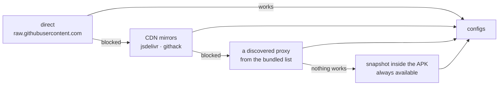

# v2rayV — the Android V2Ray client that connects itself

v2rayV is a free, open-source V2Ray / Xray VPN client for Android, for people who use public
subscription links and would rather have the client find a working server than tap through a
list of dead ones. It speaks VLESS, Reality, VMess, Trojan, Shadowsocks, Hysteria2 and TUIC.

<div align="center">


<p><b>Every other client hands you three hundred servers and wishes you luck.<br>
This one measures your line, tests servers against it, and connects on the first one that is
actually fast enough for you.</b></p>

<p>


</p>

<p>
<a href="../../releases"></a>
<a href="#building-from-source"></a>
<a href="https://github.com/morpheusadam/v2ray-config"></a>
</p>

<p>
<a href="../../stargazers"></a>
<a href="../../commits"></a>
<a href="https://kotlinlang.org"></a>
<a href="https://github.com/morpheusadam/v2ray-config"></a>
</p>

<br>


&nbsp;&nbsp;

&nbsp;&nbsp;


<sub>Connected on a server it found by itself · the drawer · Auto Mode settings</sub>

<br><br>

<sub><b>English</b> · <a href="README.fa.md">فارسی</a> · <a href="README.ru.md">Русский</a> · <a href="README.zh.md">中文</a></sub>

</div>

---

> [!NOTE]
> **Pre-release.** Auto Mode is verified end to end on a real device — power press to
> connected in about 80 seconds on a cold install. There is no tagged release yet; build from
> source. The censored-network fallback (CDN mirrors → discovered proxies) compiles and is
> unit-tested, but has not been exercised on a network that actually blocks GitHub.

## Contents

[Why](#why-this-exists) · [Auto Mode](#auto-mode) · [What makes it work](#the-decisions-that-carry-the-whole-thing) ·
[When the internet is blocked](#reaching-the-internet-when-the-internet-is-blocked) ·
[A run, end to end](#a-run-end-to-end) · [Dashboard](#the-dashboard) ·
[Install](#install) · [Build](#building-from-source) · [Layout](#project-layout) ·
[Roadmap](#roadmap) · [Credits](#credits-and-licence)

---

## Why this exists

A subscription link gives you a few hundred servers. Most are dead. Some are alive but
slower than your own connection. The client shows you all of them in a list sorted by
nothing in particular, and leaves you tapping through them one at a time, watching each fail.

v2rayV does that work itself. It imports every source you have, throws out what cannot carry
traffic, measures what survives **against your own connection speed**, and connects on the
first server that clears the bar. Then it keeps going in the background, so the next press
is instant.

Observed on a real device: **76 links merged → 609 candidates imported → 39 tunnelled → 4
kept**, line measured at 3.89 MB/s, first accepted server delivering 3.0 MB/s.

---

## Auto Mode

One button. It fetches your subscription sources, imports what it finds, filters, measures,
and keeps the winners as ready-to-use servers.

You do not pick a server. You do not run a ping test and guess what the numbers mean. You
press power.

---

## The decisions that carry the whole thing

Most of these were arrived at by measuring, and several of them contradict what everyone
else does.

| Decision | Why |
|---|---|
| **Acceptance is relative, not absolute.** A server is good enough when it delivers ≥ 70% of what your bare connection delivers. | A fixed MB/s target fails everyone on a slow line and under-serves everyone on a fast one. |
| **Your line and each server are measured by the same probe**, deliberately single-stream. | The two numbers get divided by one another, so they must be the same measurement. Measure the line the textbook way with 4–8 parallel streams and nothing ever clears 70%. |
| **TCP reachability drops hosts; it never ranks them.** | Measured on a real pool: ranking by lowest tcping passed **2.1%**, against **7.5%** for a random draw. The fastest-answering hosts are CDN edges sitting in front of dead proxies. |
| **Candidates are ordered by protocol and country read off the config, not by measurement.** Randomness is kept *within* each tier. | Ordering is free; measuring is not. Randomness inside a tier makes a run explore instead of re-confirming yesterday. |
| **Protocol order:** VLESS+REALITY / XTLS-Vision → Hysteria2 / TUIC → the rest → WireGuard last. | Follows 2026 reporting on Iranian DPI. WireGuard is reliably detected. |
| **Country order:** DE → NL → FR → TR. | Turkey has the lowest ping of the four and the least capacity, so it sorts behind the Europeans. |
| **Speed tests run strictly one at a time.** | Two downloads racing over one radio measure the radio, not the servers. |
| **A server that wins again keeps its existing entry.** | The one you selected — and the one the tunnel is running on — is not deleted out from under you. |
| **Bare subscription URLs inside a fetched body are stripped before import.** | A source that is really a list of *other* subscriptions cannot silently add itself to your source list. |
| **The reserve does not wrap.** | Working through all ten and still being unhappy is evidence the batch is bad. Handing back the first one again would hide that. |
| **Source health is [Thompson sampling](https://en.wikipedia.org/wiki/Thompson_sampling) over Beta evidence.** | Sources that keep producing good servers get tried more often, without ever starving a new one. |

Per-source statistics, filters and the source list live under **Auto Mode → Sources**.

---

## Reaching the internet when the internet is blocked

Fetching a subscription is itself censored. On a network that blocks
`raw.githubusercontent.com`, a client that cannot download its list produces nothing at all
— which is most clients, on the exact networks where it matters most.

`ProxiedFetch` walks a ladder and reports which rung worked:



The last rung ships inside the APK, so a **first run on an already-blocked network** still
has something to work with. That is the circular-bootstrap problem: the proxy list you need
in order to reach GitHub lives on GitHub.

Its lists come from **[v2ray-config](https://github.com/morpheusadam/v2ray-config)**, a
companion repository that rebuilds itself daily — every subscription proved to carry configs,
every proxy proved to open a real TLS tunnel to GitHub before it is published.

---

## A run, end to end

```
                                   ┌──────────────────┐
   power press  ─────────────────► │  baseline probe  │  your line, single stream
                                   └────────┬─────────┘
                                            │  threshold = line × 0.70
                                            ▼
   sources ──► fetch ──► import ──► filter ──► rank ──► tcping ──► speed test
   (Thompson    (route    (strip     (dedupe,  (protocol  (drop      (one at a
    sampled)     ladder)   nested     region)   country)   the dead)   time)
                           subs)                                        │
                                                                        ▼
                                          connect on the first server ≥ threshold
                                                                        │
                                            keep going in the background │
                                                                        ▼
                                     reserve of 10 ──► next press is instant
```

While it runs you get a countdown and a seven-step timeline rather than a spinner, so a slow
step is visible as a slow step instead of as a hang.

---

## The dashboard

It opens on an instrument panel, not a server list: connection state, live throughput,
session traffic, exit IP with its flag, an elapsed timer, and the Auto Mode button on one
screen. The server list is one swipe to the right.

Fixed dark, drawn on Canvas — segmented tick rings, bars and sparklines, quantised on
purpose so a jittering measurement reads as an instrument rather than claiming precision it
does not have.

A remote **notice slot** can carry an announcement or an in-app update prompt. Its normal
state is drawing nothing at all: no file, no network, malformed JSON, wrong version and
dismissed all end the same way — an empty slot.

---

## Install

No tagged release yet, so building from source is the only route today. When there is one,
it will be on the [Releases](../../releases) page as an APK.

**It installs alongside v2rayNG.** `applicationId` is `com.v2rayv.app`, so it gets its own
data, its own launcher icon and its own notification mark, and does not disturb an existing
v2rayNG install. The Kotlin namespace stays `com.v2ray.ang` because `hev-socks5-tunnel`
registers its JNI methods against that package name.

Android 7.0 (API 24) or newer.

---

## Building from source

Requires **JDK 21**, **Android SDK platform 37** with **build-tools 37.0.0**, and **NDK 29**.

```bash
git clone --recurse-submodules https://github.com/morpheusadam/v2rayV.git
cd v2rayV/V2rayNG

./gradlew assemblePlaystoreDebug -PABI_FILTERS=arm64-v8a
./gradlew testPlaystoreDebugUnitTest --tests "com.v2ray.ang.automode.*"
```

Two things are not in the repository and must be fetched first:

1. **`libv2ray.aar`** — 56 MB, from the
   [AndroidLibXrayLite releases](https://github.com/2dust/AndroidLibXrayLite/releases) whose
   tag matches the pinned submodule. Put it in `V2rayNG/app/libs/`.
2. **The `hev-socks5-tunnel` native libraries.** Run `compile-hevtun.ps1` (Windows) or
   `compile-hevtun.sh` (POSIX) to build them into `V2rayNG/app/libs/<abi>/`. On Windows the
   script also materialises the submodule's git-symlink headers as real files — without that
   the compiler reads a path string as C and fails in a way that does not explain itself.

A **release** build additionally needs `V2rayNG/signing.properties` (gitignored) with
`storeFile`, `storePassword`, `keyAlias`, `keyPassword`. Without it the release comes out
unsigned rather than debug-signed, deliberately.

<details>
<summary><b>Notes inherited from upstream</b></summary>

- `geoip.dat` and `geosite.dat` live in `Android/data/com.v2rayv.app/files/assets` (the path
  differs on some devices). The download feature pulls the enhanced build from
  [v2ray-rules-dat](https://github.com/Loyalsoldier/v2ray-rules-dat), which needs a working
  proxy first.
- The aar can be rebuilt from [AndroidLibXrayLite](https://github.com/2dust/AndroidLibXrayLite).
- On WSA, VPN permission needs `appops set com.v2rayv.app ACTIVATE_VPN allow`.
</details>

---

## Project layout

Everything below is added by this fork. The rest of the tree is upstream v2rayNG.

```
V2rayNG/app/src/main/java/com/v2ray/ang/
├── automode/
│   ├── AutoModeEngine.kt        the run: fetch → import → filter → measure → keep
│   ├── AutoModeBaseline.kt      your line, and the 70% acceptance threshold
│   ├── ThroughputProbe.kt       the one measurement used for both sides of that ratio
│   ├── AutoModeRanker.kt        protocol/country ordering, randomised within a tier
│   ├── AutoModeSpeedTester.kt   serialised speed tests over the live tunnel
│   ├── AutoModeReserve.kt       the next-connection queue; does not wrap
│   ├── AutoModeSourceManager.kt sources, filters, per-source statistics
│   ├── BetaSampler.kt           Thompson sampling over source evidence
│   ├── ProxiedFetch.kt          direct → CDN mirror → proxy → bundled snapshot
│   ├── AutoModeProxyFinder.kt   sweeps candidates to refill the ladder
│   └── AutoModeScheduler.kt     background top-ups when the reserve runs low
├── notice/                      remote notice slot and in-app update
└── ui/
    ├── dashboard/               the instrument panel, connecting card, notice card
    └── automode/                Auto Mode screens and the source list
design/logo/                     logo sources, generator and exported assets
docs/screenshots/                the images in this README, straight off a device
```

---

## Questions

<details>
<summary><b>How is this different from v2rayNG?</b></summary>

It is v2rayNG, plus Auto Mode, plus the route ladder, plus the dashboard. Everything
underneath — the cores, the protocols, the tunnel — is upstream and unchanged. If you are
happy picking servers by hand, upstream is the better choice: it is more widely tested and
has actual releases.
</details>

<details>
<summary><b>Do I need my own subscription?</b></summary>

No. It ships with the [v2ray-config](https://github.com/morpheusadam/v2ray-config) catalog,
which is rebuilt daily from measurement. Add your own under **Auto Mode → Sources** and they
are merged in, never replaced.
</details>

<details>
<summary><b>Why does the first connection take about a minute?</b></summary>

Because it is measuring rather than guessing: your line first, then candidate servers one at
a time over the live tunnel. Serialising those tests is what makes the numbers mean anything.
Every press after the first is instant — the reserve is already full.
</details>

<details>
<summary><b>Does it work in Iran, China or Russia?</b></summary>

That is what the route ladder and the protocol ordering are for, and the ordering follows
2026 reporting on DPI behaviour. Honestly: the censored path is written, unit-tested, and
**not yet proven on a genuinely blocked network**. It is the top item on the roadmap for
exactly that reason.
</details>

<details>
<summary><b>Why do DOWNLOAD and UPLOAD sometimes read zero?</b></summary>

Traffic statistics deliberately report only *proxied* bytes. Anything a routing rule sends
direct is excluded, so a rule set that bypasses the tunnel for local traffic will show zero
while that traffic flows.
</details>

<details>
<summary><b>Is it safe? Is it free?</b></summary>

Free, open source under GPL-3.0, no account, no telemetry, no analytics SDK. The servers are
public configs other people published — assume the operator of any free public server can
see your traffic, and use end-to-end encryption for anything that matters. Read the code, or
build it yourself; that is the point of the licence.
</details>

---

## Roadmap

- [ ] Exercise the censored path on a genuinely blocked network — the single most valuable
      piece of missing evidence. Until then `ProxiedFetch`, `AutoModeProxyFinder` and
      `AutoModeNetwork` are unproven.
- [ ] Confirm live DOWNLOAD/UPLOAD on a real device.
- [ ] Revisit `acceptFraction = 0.70`, currently set on judgement rather than evidence.
- [ ] Refresh the bundled `automode_*.txt` snapshots each release — they go stale.
- [ ] First tagged release.

---

## Credits and licence

v2rayV is a fork of [v2rayNG](https://github.com/2dust/v2rayNG) by
[2dust](https://github.com/2dust), which does all of the heavy lifting — the cores, the
protocols, the tunnel. Auto Mode, the route ladder and the dashboard are the additions here.

Licensed under **GPL-3.0**, the same as upstream. See [LICENSE](LICENSE).

Cores and components:
[Xray-core](https://github.com/XTLS/Xray-core) ·
[v2fly-core](https://github.com/v2fly/v2ray-core) ·
[AndroidLibXrayLite](https://github.com/2dust/AndroidLibXrayLite) ·
[hev-socks5-tunnel](https://github.com/heiher/hev-socks5-tunnel)

Also from this project: **[v2rayN-Pro-Max](https://github.com/morpheusadam/v2rayN-Pro-Max)**
(desktop, where Auto Mode started) and
**[v2ray-config](https://github.com/morpheusadam/v2ray-config)** (the daily-rebuilt lists).

---

<div align="center">

**for the victory**

If this saved you from tapping through two hundred dead servers, a ⭐ helps other people
find it.

<sub>Keywords: v2ray client android · v2rayng alternative · free vpn android open source ·
vless reality android · vmess client · trojan android · shadowsocks android · hysteria2
android · tuic client · xray core android · auto connect vpn · bypass censorship · anti-DPI ·
free v2ray config · کلاینت وی‌تو‌ری اندروید · 安卓 v2ray 客户端 · впн клиент андроид</sub>

</div>
