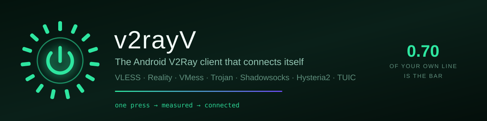
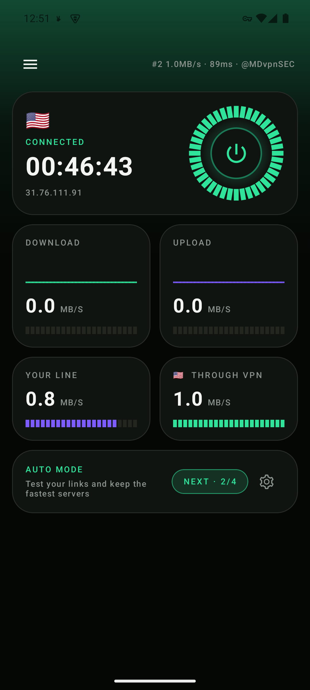
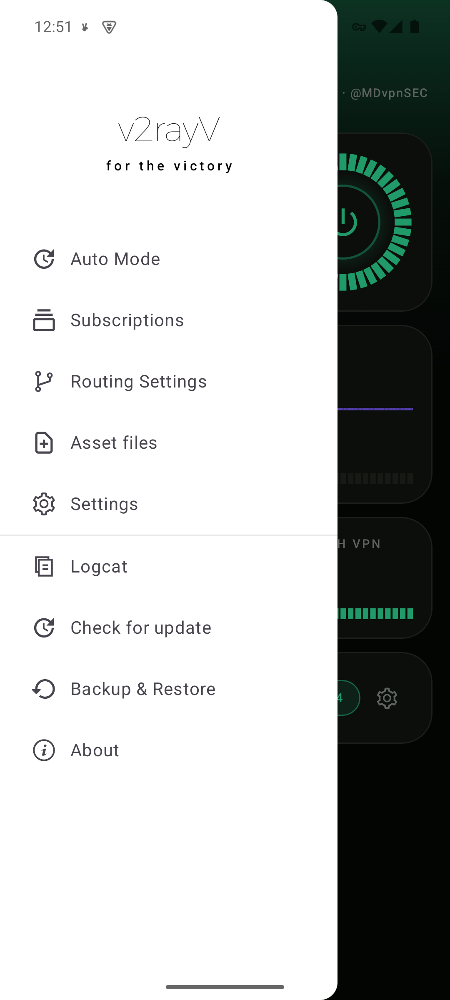
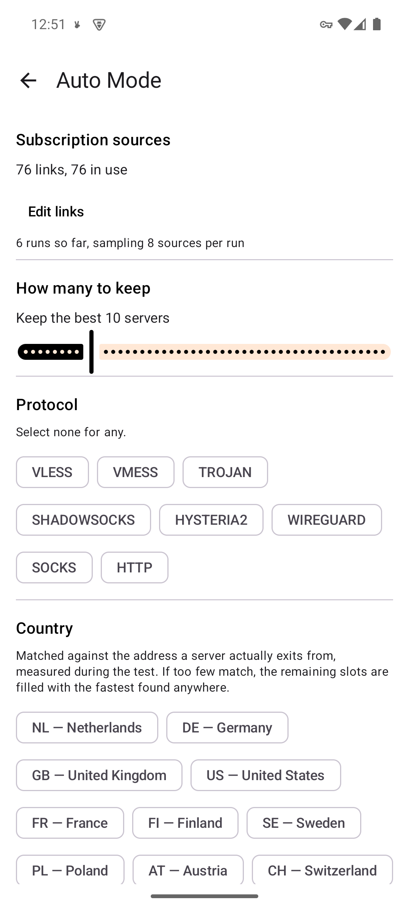
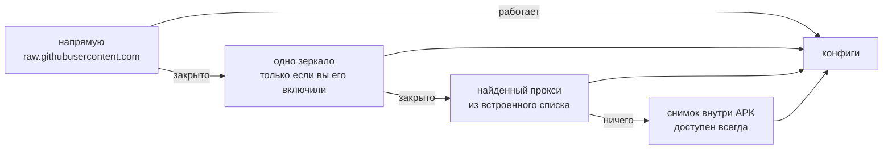

# v2rayV — Android-клиент V2Ray, который подключается сам

v2rayV — бесплатный V2Ray / Xray клиент с открытым исходным кодом для Android, для тех, кто
пользуется публичными подписками и предпочёл бы, чтобы рабочий сервер искал клиент, а не вы
вручную. Поддерживает VLESS, Reality, VMess, Trojan, Shadowsocks, Hysteria2 и TUIC.

<div align="center">




<p><b>Остальные клиенты выдают вам триста серверов и желают удачи.<br>
Этот измеряет ваш канал, проверяет серверы против него и подключается на первом, который
действительно достаточно быстр именно для вас.</b></p>

<p>


</p>


&nbsp;&nbsp;

&nbsp;&nbsp;


<sub>Подключено на сервере, который он нашёл сам · меню · настройки Auto Mode</sub>

<br><br>

<sub><a href="README.md">English</a> · <a href="README.fa.md">فارسی</a> · <b>Русский</b> · <a href="README.zh.md">中文</a></sub>

</div>

---

> [!NOTE]
> **Ранний этап.** Auto Mode проверен на реальном устройстве от начала до конца — от нажатия
> Подписанные APK лежат на
> странице [Releases](../../releases). Обходной путь для заблокированных сетей (необязательное зеркало →
> найденные прокси) компилируется и покрыт юнит-тестами, но ещё не проверялся в сети, где
> GitHub действительно закрыт.

## Зачем это

Подписка даёт несколько сотен серверов. Большая часть мертва. Часть жива, но медленнее вашего
собственного канала. Клиент показывает их списком, отсортированным ни по чему, и оставляет
вас тыкать в них по одному, глядя, как каждый не срабатывает.

v2rayV делает эту работу сам: импортирует все ваши источники, выбрасывает то, что не везёт
трафик, измеряет остальное **относительно скорости вашего канала** и подключается на первом
сервере, который проходит планку. Затем продолжает в фоне, чтобы следующее нажатие было
мгновенным.

На реальном устройстве: **76 ссылок → 609 кандидатов → 39 протуннелировано → 4 оставлено**,
канал измерен в 3,89 МБ/с, первый принятый сервер дал 3,0 МБ/с.

---

## Auto Mode

Одна кнопка. Забирает источники подписок, импортирует найденное, фильтрует, измеряет и
оставляет победителей готовыми к работе.

Вы не выбираете сервер. Вы не запускаете пинг-тест и не гадаете, что значат цифры. Вы
нажимаете питание.

---

## Решения, на которых всё держится

| Решение | Почему |
|---|---|
| **Приёмка относительная, а не абсолютная.** Сервер годен, если выдаёт ≥ 70% того, что выдаёт ваш канал без него. | Фиксированная цель в МБ/с отсекает всех на медленном канале и недодаёт всем на быстром. |
| **Ваш канал и каждый сервер меряются одним и тем же зондом**, намеренно в один поток. | Эти два числа делятся друг на друга, значит должны быть одним измерением. Померьте канал «по учебнику» в 4–8 потоков — и ни один сервер никогда не возьмёт 70%. |
| **TCP-доступность отсеивает хосты, но никогда их не ранжирует.** | На реальном пуле: сортировка по наименьшему tcping дала **2,1%** успеха против **7,5%** у случайной выборки. Быстрее всех отвечают CDN-узлы перед мёртвыми прокси. |
| **Кандидаты упорядочены по протоколу и стране из самого конфига, а не по измерению.** Случайность сохраняется *внутри* уровня. | Упорядочивание бесплатно, измерение — нет. Случайность внутри уровня заставляет запуск исследовать, а не подтверждать вчерашнее. |
| **Порядок протоколов:** VLESS+REALITY / XTLS-Vision → Hysteria2 / TUIC → остальное → WireGuard последним. | По отчётам 2026 года о DPI в Иране. WireGuard надёжно детектируется. |
| **Порядок стран:** DE → NL → FR → TR. | У Турции самый низкий пинг из четырёх и наименьшая ёмкость, поэтому она идёт после европейских. |
| **Тесты скорости идут строго по одному.** | Две загрузки, соревнующиеся в одном радиоканале, меряют радиоканал, а не серверы. |
| **Сервер, победивший снова, сохраняет свою запись.** | Тот, что вы выбрали — и на котором работает туннель — не удаляется у вас из-под ног. |
| **Голые ссылки подписок внутри загруженного тела вырезаются до импорта.** | Источник, который на деле является списком *других* подписок, не может незаметно добавить себя в ваш список источников. |
| **Резерв не зациклен.** | Пройти все десять и остаться недовольным — это свидетельство, что плоха вся партия. Выдача первого по кругу это скрыла бы. |
| **Здоровье источников — [Thompson sampling](https://en.wikipedia.org/wiki/Thompson_sampling) по Beta-свидетельствам.** | Источники, стабильно дающие хорошие серверы, проверяются чаще, и при этом новый никогда не голодает. |

Статистика по источникам, фильтры и список — в **Auto Mode → Sources**.

---

## Когда закрыт сам интернет

Скачивание подписки само по себе цензурируется. В сети, где закрыт
`raw.githubusercontent.com`, клиент, не сумевший скачать список, не даёт вообще ничего — а
это большинство клиентов, ровно в тех сетях, где это важнее всего.

`ProxiedFetch` идёт по лестнице и сообщает, какая ступень сработала:



Последняя ступень едет внутри APK, чтобы **первый запуск в уже заблокированной сети** имел с
чем работать. Это и есть проблема циклической загрузки: список прокси, нужный чтобы добраться
до GitHub, лежит на GitHub.

Списки берутся из **[v2ray-config](https://github.com/morpheusadam/v2ray-config)** —
репозитория-компаньона, который пересобирает себя каждый день.

### Зеркала выключены, пока вы их не включите

Вторая ступень — единственная, которая обращается к кому-то новому, и по умолчанию она отключена.

Запрос списка у GitHub говорит GitHub, что его кто-то запросил. Запрос у зеркала говорит то же
самое тому, кто это зеркало держит, — а зеркала это третьи стороны, которых вы не выбирали. Там,
где это приложение полезнее всего, «кто запросил список подписок и откуда» не является безобидным
фактом, и раскрывать его за вас только потому, что так загрузка вероятнее, — не наше право.

Так что запасной путь есть, работает и остаётся выключенным. Включается в **Auto Mode →
Настройки → Зеркала**, там же выбирается одно. Обращение идёт только к выбранному, никогда ко
всему списку: перебор сообщил бы каждому оператору, что именно вы запросили, ради экономии одной
неудачной попытки. Каждое названо по **тому, кто им управляет**, а не по домену — это и есть
настоящий вопрос.

| Зеркало | Кто держит | Что переживает |
|---|---|---|
| v2rayV mirror | этот проект | блокировку GitHub **и** недоступность самого GitHub |
| jsDelivr | публичный CDN | блокировку GitHub |
| raw.githack | публичный CDN | блокировку GitHub |

Разница в последней колонке и есть причина существования первого. Публичные CDN читают с GitHub по
запросу, то есть это три входные двери в одну комнату. Первое зеркало ([`mirror/`](mirror/))
отвечает из собственного хранилища и обновляется в фоне, в том числе по расписанию, — поэтому копия
уже прогрета именно в тех условиях, в которых загрузка по требованию не срабатывает.

---

## Как проходит запуск

```
                                   ┌──────────────────┐
   нажатие питания ───────────────►│  baseline probe  │  ваш канал, один поток
                                   └────────┬─────────┘
                                            │  порог = канал × 0,70
                                            ▼
   источники ─► fetch ─► импорт ─► фильтр ─► ранг ─► tcping ─► тест скорости
   (Thompson    (лестница (вырезать (дедуп,  (протокол (отсеять   (по одному
    sampling)    маршрутов) вложенные регион)  страна)  мёртвых)   за раз)
                            подписки)                                   │
                                                                        ▼
                                  подключение на первом сервере ≥ порога
                                                                        │
                                              работа продолжается в фоне│
                                                                        ▼
                                     резерв из 10 ──► следующее нажатие мгновенно
```

Пока идёт запуск, показывается обратный отсчёт и таймлайн из семи шагов вместо спиннера,
чтобы медленный шаг выглядел медленным шагом, а не зависанием.

---

## Панель

Открывается приборная панель, а не список серверов: состояние подключения, скорость в реальном
времени, трафик сессии, выходной IP с флагом, таймер и кнопка Auto Mode на одном экране.
Список серверов — один свайп вправо.

Фиксированная тёмная, нарисованная на Canvas: сегментные кольца, столбики и спарклайны,
намеренно квантованные, чтобы дрожащее измерение читалось как прибор, а не претендовало на
точность, которой у него нет.

Удалённый **слот уведомления** может нести объявление или предложение обновиться. Его
нормальное состояние — не рисовать ничего: нет файла, нет сети, битый JSON, не та версия и
закрытое пользователем заканчиваются одинаково — пустым местом.

---

## Установка

Подписанные APK лежат на странице [Releases](../../releases) — по одному на каждый ABI плюс
сборка `universal`, если вы не знаете, какой у вас. Почти всем телефонам с 2018 года нужен
`arm64-v8a`. Рядом с каждым APK лежит отделённая GPG-подпись и открытый ключ, так что файл,
пришедший через зеркало или мессенджер, можно проверить до установки.

Сборка из исходников тоже работает и описана ниже.

**Ставится рядом с v2rayNG.** `applicationId` — `com.v2rayv.app`, так что у него свои данные,
своя иконка и своя метка уведомления, и он не мешает установленному v2rayNG. Namespace Kotlin
остаётся `com.v2ray.ang`, потому что `hev-socks5-tunnel` регистрирует свои JNI-методы под
этим именем пакета.

Android 7.0 (API 24) и новее.

---

## Сборка из исходников

Нужны **JDK 21**, **Android SDK platform 37** с **build-tools 37.0.0** и **NDK 29**.

```bash
git clone --recurse-submodules https://github.com/morpheusadam/v2rayV.git
cd v2rayV/V2rayNG

./gradlew assemblePlaystoreDebug -PABI_FILTERS=arm64-v8a
./gradlew testPlaystoreDebugUnitTest --tests "com.v2ray.ang.automode.*"
```

Двух вещей нет в репозитории, их нужно взять заранее:

1. **`libv2ray.aar`** — 56 МБ, из
   [релизов AndroidLibXrayLite](https://github.com/2dust/AndroidLibXrayLite/releases) с тегом,
   совпадающим с закреплённым сабмодулем. Положить в `V2rayNG/app/libs/`.
2. **Нативные библиотеки `hev-socks5-tunnel`.** Соберите их через `compile-hevtun.ps1`
   (Windows) или `compile-hevtun.sh` (POSIX) в `V2rayNG/app/libs/<abi>/`. На Windows скрипт
   ещё и превращает git-симлинки заголовков в настоящие файлы — без этого компилятор читает
   строку с путём как код на C и падает так, что сам себя не объясняет.

Сборка **release** дополнительно требует `V2rayNG/signing.properties` (в gitignore) с
`storeFile`, `storePassword`, `keyAlias`, `keyPassword`. Без него релиз выходит неподписанным,
а не подписанным отладочным ключом — намеренно.

---

## Вопросы

<details>
<summary><b>Чем это отличается от v2rayNG?</b></summary>

Это и есть v2rayNG плюс Auto Mode, плюс лестница маршрутов, плюс панель. Всё, что ниже —
ядра, протоколы, туннель — апстрим и не тронуто. Если вам нормально выбирать серверы руками,
апстрим лучше: он шире оттестирован и у него есть релизы.
</details>

<details>
<summary><b>Нужна ли своя подписка?</b></summary>

Нет. Клиент идёт с каталогом [v2ray-config](https://github.com/morpheusadam/v2ray-config),
который пересобирается ежедневно по измерениям. Свои добавляются в **Auto Mode → Sources** и
именно добавляются, а не заменяют встроенные.
</details>

<details>
<summary><b>Почему первое подключение занимает около минуты?</b></summary>

Потому что он измеряет, а не гадает: сначала ваш канал, затем серверы-кандидаты по одному
через живой туннель. Именно последовательность этих тестов и делает цифры осмысленными. Каждое
следующее нажатие мгновенно — резерв уже полон.
</details>

<details>
<summary><b>Работает ли в России, Иране, Китае?</b></summary>

Для этого и сделаны лестница маршрутов и порядок протоколов, а сам порядок следует отчётам
2026 года о поведении DPI. Честно: путь через цензуру написан, покрыт юнит-тестами и **ещё не
проверен в по-настоящему заблокированной сети**. Именно поэтому он первым пунктом в планах.
</details>

<details>
<summary><b>Почему DOWNLOAD и UPLOAD иногда показывают ноль?</b></summary>

Статистика трафика намеренно считает только *проксированные* байты. Всё, что правило
маршрутизации отправляет напрямую, исключено, поэтому набор правил, выводящий локальный трафик
мимо туннеля, показывает ноль, пока этот трафик идёт.
</details>

<details>
<summary><b>Это безопасно? Это бесплатно?</b></summary>

Бесплатно, открытый код под GPL-3.0, без аккаунта, без телеметрии, без аналитических SDK.
Серверы — публичные конфиги, опубликованные другими людьми: исходите из того, что оператор
любого бесплатного публичного сервера видит ваш трафик, и используйте сквозное шифрование для
всего важного. Читайте код или соберите сами — в этом смысл лицензии.
</details>

---

## Планы

- [ ] Проверить путь через цензуру в по-настоящему заблокированной сети — самое ценное из
      недостающих свидетельств.
- [ ] Подтвердить живые DOWNLOAD/UPLOAD на реальном устройстве.
- [ ] Пересмотреть `acceptFraction = 0.70`, выставленный по суждению, а не по данным.
- [ ] Обновлять встроенные снимки `automode_*.txt` при каждом релизе.
- [ ] Первый тегированный релиз.

---

## Благодарности и лицензия

v2rayV — форк [v2rayNG](https://github.com/2dust/v2rayNG) от
[2dust](https://github.com/2dust), который делает всю тяжёлую работу: ядра, протоколы,
туннель. Auto Mode, лестница маршрутов и панель — дополнения здесь.

Лицензия **GPL-3.0**, как и у апстрима. См. [LICENSE](LICENSE).

Ядра и компоненты:
[Xray-core](https://github.com/XTLS/Xray-core) ·
[v2fly-core](https://github.com/v2fly/v2ray-core) ·
[AndroidLibXrayLite](https://github.com/2dust/AndroidLibXrayLite) ·
[hev-socks5-tunnel](https://github.com/heiher/hev-socks5-tunnel)

Из этого же проекта: **[v2rayN-Pro-Max](https://github.com/morpheusadam/v2rayN-Pro-Max)**
(десктоп, откуда пошёл Auto Mode) и
**[v2ray-config](https://github.com/morpheusadam/v2ray-config)** (ежедневно пересобираемые
списки).

---

<div align="center">

**for the victory**

Если это избавило вас от перебора двухсот мёртвых серверов, ⭐ поможет другим это найти.

<sub>Ключевые слова: v2ray клиент андроид · аналог v2rayng · бесплатный впн андроид открытый
код · vless reality android · vmess клиент · trojan андроид · shadowsocks андроид ·
hysteria2 · tuic · xray core android · обход блокировок · анти-DPI ·
v2ray client android · 安卓 v2ray 客户端 · کلاینت وی‌تو‌ری اندروید</sub>

</div>
