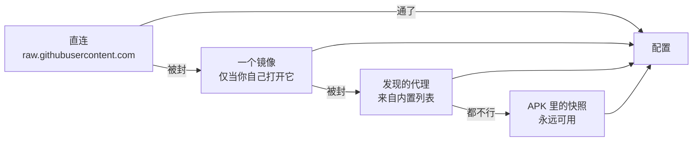

# v2rayV — 会自己连上的安卓 V2Ray 客户端

v2rayV 是一个免费开源的安卓 V2Ray / Xray 客户端，做给那些用公共订阅、又不想手动一个个试节点的人。
支持 VLESS、Reality、VMess、Trojan、Shadowsocks、Hysteria2 和 TUIC。

<div align="center">


<p><b>别的客户端丢给你三百个节点，然后祝你好运。<br>
这个先量你自己的线路，再拿节点跟它比，最后连上第一个对你来说真的够快的。</b></p>

<p>


</p>


&nbsp;&nbsp;

&nbsp;&nbsp;


<sub>连在它自己找到的节点上 · 侧边菜单 · Auto Mode 设置</sub>

<br><br>

<sub><a href="README.md">English</a> · <a href="README.fa.md">فارسی</a> · <a href="README.ru.md">Русский</a> · <b>中文</b></sub>

</div>

---

> [!NOTE]
> **早期阶段。** Auto Mode 已在真机上完整验证。已签名的
> APK 发在 [Releases](../../releases) 页面。被封锁网络下的备用路径（可选镜像 → 发现的代理）能编译、
> 有单元测试，但还没有在真正封锁 GitHub 的网络里跑过。

## 为什么会有这个东西

一条订阅给你几百个节点。大部分是死的。有些活着，但比你自己的宽带还慢。客户端把它们排成一个没有任何
排序依据的列表，然后让你一个一个点，看着它们一个一个失败。

v2rayV 自己干这件事：导入你所有的源，扔掉跑不动流量的，把剩下的**拿你自己的线路速度作参照**测一遍，
连上第一个过线的节点。然后它在后台继续跑，所以下一次按下去是瞬间的。

真机实测：**76 条链接 → 导入 609 个候选 → 39 个成功建隧道 → 留下 4 个**，线路测得 3.89 MB/s，第一个
被接受的节点跑出 3.0 MB/s。

---

## Auto Mode

一个按钮。抓订阅源，导入找到的内容，过滤、测量，把胜出的节点留成随时可用的服务器。

你不挑节点。你不用跑 ping 测试再猜那些数字什么意思。你按电源键。

---

## 撑起整件事的那些决定

| 决定 | 为什么 |
|---|---|
| **接受标准是相对的，不是绝对的。** 节点跑出你裸连速度的 ≥ 70% 就算合格。 | 固定的 MB/s 目标会让慢线路上的人全军覆没，又让快线路上的人被将就。 |
| **你的线路和每个节点用同一个探针测**，故意单线程。 | 这两个数要相除，所以必须是同一种测量。按教科书用 4–8 条并发去测线路，那就没有任何节点能过 70%。 |
| **TCP 可达性只用来淘汰主机，绝不用来排序。** | 在真实节点池上实测：按最低 tcping 排序通过率 **2.1%**，随机抽取是 **7.5%**。响应最快的是挡在死代理前面的 CDN 边缘。 |
| **候选按配置里写的协议和国家排序，不按测量结果排。** 随机性保留在*每一层内部*。 | 排序不要钱，测量要钱。层内随机让每次运行去探索，而不是重新确认昨天的结论。 |
| **协议顺序：** VLESS+REALITY / XTLS-Vision → Hysteria2 / TUIC → 其余 → WireGuard 最后。 | 依据 2026 年关于伊朗 DPI 的报告。WireGuard 能被稳定识别出来。 |
| **国家顺序：** DE → NL → FR → TR。 | 土耳其在这四个里 ping 最低、容量最小，所以排在欧洲几个后面。 |
| **测速严格一次只跑一个。** | 两个下载在同一个射频上抢带宽，测的是射频，不是节点。 |
| **再次胜出的节点保留原有条目。** | 你选中的那个 —— 也是隧道正跑着的那个 —— 不会在你脚下被删掉。 |
| **抓到的内容里裸的订阅链接会在导入前被剥掉。** | 一个其实是*别人订阅清单*的源，不能悄悄把自己加进你的源列表。 |
| **备用队列不循环。** | 十个都走完还是不满意，说明这一批本身就不行。把第一个再发一遍只会掩盖这一点。 |
| **源的健康度用 [Thompson sampling](https://en.wikipedia.org/wiki/Thompson_sampling) 跑 Beta 证据。** | 持续产出好节点的源会被更频繁地试，同时新源永远不会被饿死。 |

每个源的统计、过滤器和源列表都在 **Auto Mode → Sources**。

---

## 当互联网本身被封的时候

下载订阅这件事本身就被审查。在封了 `raw.githubusercontent.com` 的网络里，下不到列表的客户端什么都
产不出来 —— 而这正是大多数客户端的处境，偏偏就在最需要它的那些网络上。

`ProxiedFetch` 会沿着一架梯子往上爬，并告诉你哪一级成功了：



最后一级打包在 APK 里，好让**在一个本来就被封的网络上的首次运行**也有东西可用。这就是那个循环启动
问题：你需要用来够到 GitHub 的代理列表，本身就放在 GitHub 上。

它的列表来自 **[v2ray-config](https://github.com/morpheusadam/v2ray-config)**，一个每天自我重建的
配套仓库。

### 镜像默认关闭，要你自己打开

第二级是唯一一个会跟新的人说话的环节，而它默认是关的。

向 GitHub 要订阅列表，GitHub 就知道有一个地址要了它。向镜像要，运营镜像的人也同样知道 —— 而这些
镜像是你从未选择过的第三方。在这个应用最有用的那些地方，「谁要了订阅列表、从哪里要的」并不是一件
无害的事；仅仅因为这样抓取更可能成功，就替你把它透露出去，不是我们该做的决定。

所以这条备用路径存在、可用，并且保持关闭。在 **Auto Mode → 设置 → 镜像** 里打开，并选一个。只有
你选中的那个会被访问，绝不会遍历整个列表 —— 逐个去试等于为了省下一次失败的抓取，把你要了什么告诉
名单上的每一个运营者。每个镜像按**谁在运营它**来命名，而不是按域名，因为那才是真正要回答的问题。

| 镜像 | 谁在运营 | 能扛住什么 |
|---|---|---|
| v2rayV mirror | 本项目 | GitHub 被封**以及** GitHub 本身挂掉 |
| jsDelivr | 公共 CDN | GitHub 被封 |
| raw.githack | 公共 CDN | GitHub 被封 |

最后一列的差别就是第一个存在的理由。公共 CDN 是按需去 GitHub 读的，所以它们是通往同一个房间的三扇
门。第一个镜像（[`mirror/`](mirror/)）从自己的存储回答，并在后台刷新，也按计划刷新 —— 于是恰恰在
按需抓取最可能失败的那种情况下，副本已经是热的。

---

## 一次运行，从头到尾

```
                                   ┌──────────────────┐
   按下电源键 ───────────────────►  │  baseline probe  │  你的线路，单线程
                                   └────────┬─────────┘
                                            │  门槛 = 线路 × 0.70
                                            ▼
   源 ──► 抓取 ──► 导入 ──► 过滤 ──► 排序 ──► tcping ──► 测速
   (Thompson  (路由   (剥掉嵌套  (去重、  (协议、    (淘汰      (一次
    抽样)      梯子)    的订阅)    地区)   国家)      死的)      一个)
                                                                        │
                                                                        ▼
                                            连上第一个过门槛的节点
                                                                        │
                                                     后台继续跑          │
                                                                        ▼
                                        10 个备用 ──► 下一次按下是瞬间的
```

运行时显示的是倒计时和七步时间线，而不是转圈图标 —— 慢的那一步看起来就是慢，而不是卡死。

---

## 仪表盘

打开就是仪表盘，不是节点列表：连接状态、实时速率、本次会话流量、带国旗的出口 IP、计时器，以及
Auto Mode 按钮，全在一屏里。节点列表向右滑一下就是。

固定深色，用 Canvas 画的 —— 分段刻度环、柱条和迷你折线，刻意做了量化，让抖动的读数看起来像仪表，
而不是宣称自己有并不具备的精度。

一个远程**通知位**可以承载公告或应用内更新提示。它的常态是什么都不画：没有文件、没有网络、JSON 损坏、
版本不匹配、用户已关闭，结果都一样 —— 空的。

---

## 安装

已签名的 APK 发在 [Releases](../../releases) 页面 —— 每个 ABI 一个，另外还有一个 `universal`
构建，适合不确定自己手机架构的人。2018 年之后的手机基本都要 `arm64-v8a`。每个 APK 旁边都附有
分离式 GPG 签名和公钥，所以通过镜像或聊天软件拿到的文件可以在安装前先校验。

从源码构建同样可行，说明在下面。

**它和 v2rayNG 并存。** `applicationId` 是 `com.v2rayv.app`，所以它有自己的数据、自己的图标和自己的
通知标识，不会影响已装的 v2rayNG。Kotlin 命名空间仍然是 `com.v2ray.ang`，因为 `hev-socks5-tunnel`
是按这个包名注册 JNI 方法的。

需要 Android 7.0（API 24）或更高。

---

## 从源码构建

需要 **JDK 21**、带 **build-tools 37.0.0** 的 **Android SDK platform 37**，以及 **NDK 29**。

```bash
git clone --recurse-submodules https://github.com/morpheusadam/v2rayV.git
cd v2rayV/V2rayNG

./gradlew assemblePlaystoreDebug -PABI_FILTERS=arm64-v8a
./gradlew testPlaystoreDebugUnitTest --tests "com.v2ray.ang.automode.*"
```

有两样东西不在仓库里，需要先准备：

1. **`libv2ray.aar`** —— 56 MB，从
   [AndroidLibXrayLite releases](https://github.com/2dust/AndroidLibXrayLite/releases) 里取标签与
   固定的子模块相符的那个，放进 `V2rayNG/app/libs/`。
2. **`hev-socks5-tunnel` 的原生库。** 用 `compile-hevtun.ps1`（Windows）或 `compile-hevtun.sh`
   （POSIX）编译到 `V2rayNG/app/libs/<abi>/`。在 Windows 上脚本还会把子模块里 git 符号链接形式的头
   文件变成真实文件 —— 没有这一步，编译器会把一串路径当成 C 代码读，然后以一种完全不解释自己的方式
   失败。

**release** 构建还需要 `V2rayNG/signing.properties`（已 gitignore），内含 `storeFile`、
`storePassword`、`keyAlias`、`keyPassword`。没有它，release 会是未签名的，而不是用 debug 证书签名 ——
这是故意的。

---

## 常见问题

<details>
<summary><b>和 v2rayNG 有什么区别？</b></summary>

它就是 v2rayNG，加上 Auto Mode、路由梯子和仪表盘。底下的一切 —— 内核、协议、隧道 —— 都是上游的，没
动过。如果你本来就习惯手动挑节点，上游是更好的选择：测试面更广，而且有正式发布。
</details>

<details>
<summary><b>需要自己的订阅吗？</b></summary>

不需要。它自带 [v2ray-config](https://github.com/morpheusadam/v2ray-config) 目录，每天按实测重建。
自己的源在 **Auto Mode → Sources** 里加进去，是合并，不是替换。
</details>

<details>
<summary><b>为什么第一次连接要一分钟左右？</b></summary>

因为它在测，不是在猜：先测你的线路，再通过真实隧道一个一个测候选节点。正是这种串行才让数字有意义。
之后每一次按下都是瞬间的 —— 备用队列已经满了。
</details>

<details>
<summary><b>在中国、伊朗、俄罗斯能用吗？</b></summary>

路由梯子和协议排序就是为此存在的，排序依据是 2026 年关于 DPI 行为的报告。说实话：绕过审查的这条路
写好了、有单元测试，但**还没有在真正被封锁的网络里得到验证**。这正是它排在路线图第一位的原因。
</details>

<details>
<summary><b>为什么 DOWNLOAD 和 UPLOAD 有时是零？</b></summary>

流量统计刻意只算*走代理的*字节。被路由规则直连出去的部分不计入，所以一套把本地流量绕过隧道的规则，
在那部分流量跑着的时候会显示为零。
</details>

<details>
<summary><b>安全吗？免费吗？</b></summary>

免费，GPL-3.0 开源，无账号、无遥测、无统计 SDK。节点是别人公开发布的配置 —— 请默认任何免费公共节点
的运营者都能看见你的流量，重要的东西一律走端到端加密。看代码，或者自己构建；这就是这份许可证的意义。
</details>

---

## 路线图

- [ ] 在真正被封锁的网络上跑通审查路径 —— 目前最缺、也最有价值的一份证据。
- [ ] 在真机上确认 DOWNLOAD/UPLOAD 实时数值。
- [ ] 重新审视 `acceptFraction = 0.70`，它目前是凭判断而不是凭数据定的。
- [ ] 每次发布时刷新内置的 `automode_*.txt` 快照。
- [x] 第一个打标签的版本。

---

## 致谢与许可

v2rayV 是 [2dust](https://github.com/2dust) 的 [v2rayNG](https://github.com/2dust/v2rayNG) 的分支，
重活都是它干的 —— 内核、协议、隧道。Auto Mode、路由梯子和仪表盘是这里加的。

以 **GPL-3.0** 授权，与上游相同。见 [LICENSE](LICENSE)。

内核与组件：
[Xray-core](https://github.com/XTLS/Xray-core) ·
[v2fly-core](https://github.com/v2fly/v2ray-core) ·
[AndroidLibXrayLite](https://github.com/2dust/AndroidLibXrayLite) ·
[hev-socks5-tunnel](https://github.com/heiher/hev-socks5-tunnel)

同一个项目下还有：**[v2rayN-Pro-Max](https://github.com/morpheusadam/v2rayN-Pro-Max)**（桌面端，
Auto Mode 最早的出处）和 **[v2ray-config](https://github.com/morpheusadam/v2ray-config)**（每天重建
的列表）。

---

<div align="center">

**for the victory**

如果它让你少点了两百个死节点，点个 ⭐ 能让更多人找到它。

<sub>关键词：安卓 v2ray 客户端 · v2rayng 替代 · 免费 VPN 安卓 开源 · vless reality 安卓 · vmess 客户端 ·
trojan 安卓 · shadowsocks 安卓 · hysteria2 · tuic · xray 内核 安卓 · 科学上网 · 翻墙 · 抗 DPI ·
v2ray client android · کلاینت وی‌تو‌ری اندروید · впн клиент андроид</sub>

</div>
